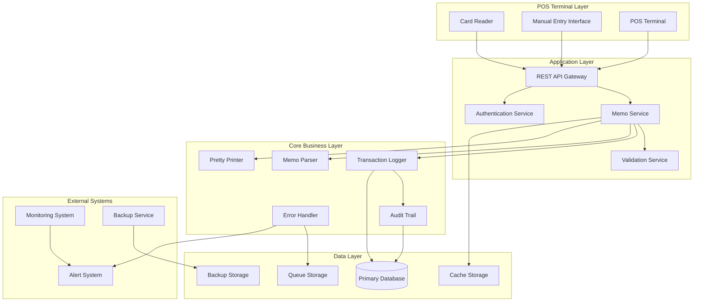

# Design Document: Debit-Credit Memo System

## Overview

The Debit-Credit Memo System is a comprehensive transaction memo handling solution for Point of Sale (POS) environments. The system provides automatic logging of card-based transactions, manual entry capabilities, robust validation, and comprehensive audit trails while maintaining high performance and security standards.

### Key Design Principles

- **Event-Driven Architecture**: Reactive system responding to card reader events and user actions
- **Immutable Audit Trail**: All memo records are write-once, ensuring data integrity
- **Resilient Error Handling**: Multi-layered error recovery with graceful degradation
- **Modular Design**: Loosely coupled components for maintainability and testability
- **Security-First**: End-to-end encryption and role-based access control

## Architecture

### High-Level System Architecture



### Component Responsibilities

| Component | Primary Responsibility | Secondary Responsibilities |
|-----------|----------------------|---------------------------|
| **Memo Service** | Core memo operations | Orchestration, business logic |
| **Transaction Logger** | Persistent memo storage | Audit trail management |
| **Validation Service** | Data integrity validation | Business rule enforcement |
| **Memo Parser** | ISO 8583 message parsing | Data format standardization |
| **Pretty Printer** | JSON formatting | API response formatting |
| **Error Handler** | Error recovery and resilience | Alert generation, queue management |
| **Audit Trail** | Immutable record keeping | Compliance logging |
| **Authentication Service** | User authentication | Role-based access control |

## Components and Interfaces

### 1. Memo Service

**Purpose**: Central orchestrator for all memo operations

**Interface**:
```typescript
interface MemoService {
  createCardMemo(cardTransaction: CardTransaction): Promise<MemoRecord>
  createManualMemo(manualEntry: ManualMemoRequest, userId: string): Promise<MemoRecord>
  getMemo(transactionId: string): Promise<MemoRecord>
  searchMemos(criteria: SearchCriteria): Promise<MemoRecord[]>
  generateReconciliationReport(dateRange: DateRange): Promise<ReconciliationReport>
}
```

**Key Methods**:
- `createCardMemo()`: Processes automatic card-based memo creation
- `createManualMemo()`: Handles manual memo entry with authorization
- `getMemo()`: Retrieves memo by transaction ID with audit logging
- `searchMemos()`: Filtered memo search with pagination
- `generateReconciliationReport()`: Daily reconciliation report generation

### 2. Transaction Logger

**Purpose**: Persistent storage and audit trail management

**Interface**:
```typescript
interface TransactionLogger {
  logMemo(memo: MemoRecord): Promise<string>
  logAccess(transactionId: string, userId: string): Promise<void>
  logError(error: MemoError): Promise<void>
  retrieveMemo(transactionId: string): Promise<MemoRecord>
  retrieveMemosByDateRange(start: Date, end: Date): Promise<MemoRecord[]>
}
```

**Features**:
- Immutable record storage
- Automatic Transaction_ID generation
- Audit trail logging for all operations
- 7-year retention policy enforcement

### 3. Validation Service

**Purpose**: Data integrity and business rule validation

**Interface**:
```typescript
interface ValidationService {
  validateMemoAmount(amount: number): ValidationResult
  validateMemoDescription(description: string): ValidationResult
  validateTimestamp(timestamp: Date): ValidationResult
  validateDuplicateTransaction(transactionId: string): Promise<ValidationResult>
  requiresAuthorization(amount: number, userRole: UserRole): boolean
}
```

**Validation Rules**:
- Amount: Positive numbers, max 2 decimal places, $10,000 limit
- Description: Alphanumeric + approved symbols only
- Timestamp: No future dates allowed
- Duplicate prevention: Transaction_ID uniqueness

### 4. Memo Parser

**Purpose**: ISO 8583 message parsing and data standardization

**Interface**:
```typescript
interface MemoParser {
  parseCardTransaction(iso8583Message: string): ParseResult<CardTransaction>
  parseManualEntry(rawData: ManualMemoData): ParseResult<MemoRecord>
  validateFormat(data: unknown): FormatValidationResult
}
```

**Parsing Features**:
- ISO 8583 standard compliance
- International currency symbol support
- Special character handling
- Descriptive error messages with field-specific details

### 5. Pretty Printer

**Purpose**: Standardized JSON formatting for API responses

**Interface**:
```typescript
interface PrettyPrinter {
  formatMemoRecord(memo: MemoRecord): string
  formatReconciliationReport(report: ReconciliationReport): string
  formatErrorResponse(error: MemoError): string
}
```

### 6. Error Handler

**Purpose**: Resilient error recovery and system reliability

**Interface**:
```typescript
interface ErrorHandler {
  handleDatabaseFailure(operation: MemoOperation): Promise<void>
  handleCardReaderFailure(error: CardReaderError): Promise<void>
  retryOperation(operation: RetryableOperation): Promise<OperationResult>
  queueForLaterProcessing(memo: MemoRecord): Promise<void>
  sendAlert(alert: SystemAlert): Promise<void>
}
```

**Recovery Strategies**:
- Database failure: Local queue with sync on recovery
- Card reader failure: Manual entry fallback
- Memory pressure: Operation prioritization
- Exponential backoff retry (max 3 attempts)

## Data Models

### Core Data Structures

#### MemoRecord
```typescript
interface MemoRecord {
  transactionId: string           // Unique identifier (UUID)
  memoType: 'DEBIT' | 'CREDIT'  // Transaction type
  amount: number                  // Transaction amount (2 decimal places)
  description: string             // Memo description
  timestamp: Date                 // Transaction timestamp
  terminalId: string             // POS terminal identifier
  cardType?: string              // Card type (if card transaction)
  userId?: string                // User ID (if manual entry)
  authorizationCode?: string     // Authorization for high-value transactions
  createdAt: Date                // Record creation timestamp
  createdBy: string              // System or user identifier
}
```

#### CardTransaction
```typescript
interface CardTransaction {
  cardType: string               // VISA, MASTERCARD, AMEX, etc.
  amount: number                 // Transaction amount
  terminalId: string            // Terminal identifier
  timestamp: Date               // Transaction timestamp
  iso8583Data: string           // Raw ISO 8583 message
  authorizationCode?: string    // Card authorization code
}
```

#### ManualMemoRequest
```typescript
interface ManualMemoRequest {
  memoType: 'DEBIT' | 'CREDIT'
  amount: number
  description: string
  timestamp?: Date              // Optional, defaults to current time
  requiresAuthorization: boolean
  authorizationCode?: string
}
```

#### ReconciliationReport
```typescript
interface ReconciliationReport {
  reportId: string
  dateRange: DateRange
  totalTransactions: number
  totalDebits: number
  totalCredits: number
  netAmount: number
  discrepancies: Discrepancy[]
  generatedAt: Date
  generatedBy: string
}
```

### Database Schema

#### Primary Tables

**memo_records**
```sql
CREATE TABLE memo_records (
    transaction_id VARCHAR(36) PRIMARY KEY,
    memo_type ENUM('DEBIT', 'CREDIT') NOT NULL,
    amount DECIMAL(10,2) NOT NULL CHECK (amount > 0),
    description VARCHAR(500) NOT NULL,
    timestamp TIMESTAMP NOT NULL,
    terminal_id VARCHAR(50) NOT NULL,
    card_type VARCHAR(20),
    user_id VARCHAR(50),
    authorization_code VARCHAR(100),
    created_at TIMESTAMP DEFAULT CURRENT_TIMESTAMP,
    created_by VARCHAR(50) NOT NULL,
    INDEX idx_timestamp (timestamp),
    INDEX idx_terminal_id (terminal_id),
    INDEX idx_created_at (created_at)
);
```

**audit_trail**
```sql
CREATE TABLE audit_trail (
    audit_id VARCHAR(36) PRIMARY KEY,
    transaction_id VARCHAR(36) NOT NULL,
    action_type ENUM('CREATE', 'ACCESS', 'ERROR') NOT NULL,
    user_id VARCHAR(50),
    terminal_id VARCHAR(50),
    timestamp TIMESTAMP DEFAULT CURRENT_TIMESTAMP,
    details JSON,
    FOREIGN KEY (transaction_id) REFERENCES memo_records(transaction_id)
);
```

**error_log**
```sql
CREATE TABLE error_log (
    error_id VARCHAR(36) PRIMARY KEY,
    error_type VARCHAR(100) NOT NULL,
    error_message TEXT NOT NULL,
    transaction_id VARCHAR(36),
    user_id VARCHAR(50),
    terminal_id VARCHAR(50),
    timestamp TIMESTAMP DEFAULT CURRENT_TIMESTAMP,
    resolved BOOLEAN DEFAULT FALSE
);
```

**queued_operations**
```sql
CREATE TABLE queued_operations (
    queue_id VARCHAR(36) PRIMARY KEY,
    operation_type VARCHAR(50) NOT NULL,
    operation_data JSON NOT NULL,
    retry_count INT DEFAULT 0,
    max_retries INT DEFAULT 3,
    next_retry_at TIMESTAMP,
    created_at TIMESTAMP DEFAULT CURRENT_TIMESTAMP,
    processed BOOLEAN DEFAULT FALSE
);
```

## API Design

### REST Endpoints

#### Memo Operations

**POST /api/v1/memos/card**
- **Purpose**: Create memo from card transaction
- **Request Body**: `CardTransaction`
- **Response**: `MemoRecord`
- **Status Codes**: 201 (Created), 400 (Bad Request), 500 (Server Error)

**POST /api/v1/memos/manual**
- **Purpose**: Create manual memo entry
- **Request Body**: `ManualMemoRequest`
- **Response**: `MemoRecord`
- **Authorization**: Required (Bearer token)
- **Status Codes**: 201 (Created), 401 (Unauthorized), 403 (Forbidden), 400 (Bad Request)

**GET /api/v1/memos/{transactionId}**
- **Purpose**: Retrieve memo by transaction ID
- **Response**: `MemoRecord`
- **Authorization**: Required
- **Status Codes**: 200 (OK), 404 (Not Found), 401 (Unauthorized)

**GET /api/v1/memos**
- **Purpose**: Search memos with filters
- **Query Parameters**: 
  - `startDate`, `endDate` (ISO 8601)
  - `terminalId` (string)
  - `memoType` (DEBIT|CREDIT)
  - `page`, `limit` (pagination)
- **Response**: `PaginatedResponse<MemoRecord[]>`
- **Authorization**: Required

#### Reporting

**GET /api/v1/reports/reconciliation**
- **Purpose**: Generate reconciliation report
- **Query Parameters**: `startDate`, `endDate`, `terminalId`
- **Response**: `ReconciliationReport`
- **Authorization**: Manager role required

**GET /api/v1/reports/reconciliation/{reportId}/export**
- **Purpose**: Export reconciliation report
- **Query Parameters**: `format` (csv|pdf)
- **Response**: File download
- **Authorization**: Manager role required

#### System Operations

**GET /api/v1/system/health**
- **Purpose**: System health check
- **Response**: `HealthStatus`
- **Authorization**: None

**POST /api/v1/system/maintenance**
- **Purpose**: Enter maintenance mode
- **Authorization**: Administrator role required

### API Response Format

**Standard Success Response**:
```json
{
  "success": true,
  "data": { /* response data */ },
  "timestamp": "2024-01-15T10:30:00Z",
  "requestId": "req_123456789"
}
```

**Standard Error Response**:
```json
{
  "success": false,
  "error": {
    "code": "VALIDATION_ERROR",
    "message": "Invalid memo amount",
    "details": {
      "field": "amount",
      "value": "-100.00",
      "constraint": "must be positive"
    }
  },
  "timestamp": "2024-01-15T10:30:00Z",
  "requestId": "req_123456789"
}
```

## Integration Points

### Card Reader Integration

**Integration Method**: Event-driven via POS API
**Communication Protocol**: HTTP/HTTPS with JSON payloads
**Event Types**:
- `card.transaction.completed`
- `card.transaction.failed`
- `card.reader.disconnected`

**Event Handler**:
```typescript
interface CardReaderEventHandler {
  onTransactionCompleted(event: CardTransactionEvent): Promise<void>
  onTransactionFailed(event: CardTransactionFailedEvent): Promise<void>
  onReaderDisconnected(event: ReaderDisconnectedEvent): Promise<void>
}
```

### POS System Integration

**Integration Points**:
1. **Transaction Events**: Real-time transaction notifications
2. **User Authentication**: Shared authentication service
3. **Terminal Management**: Terminal configuration and status
4. **Reporting Integration**: Consolidated financial reports

**API Compatibility**:
- REST API endpoints for third-party integrations
- Webhook support for real-time notifications
- Standard POS message formats (ISO 8583)

### External System Integrations

**Monitoring System**:
- Health check endpoints
- Performance metrics export
- Alert webhook notifications

**Backup Service**:
- Automated backup triggers
- Backup verification callbacks
- Disaster recovery coordination

## Security Design

### Authentication and Authorization

**Authentication Method**: JWT Bearer tokens
**Token Expiration**: 8 hours (business day)
**Refresh Token**: 30 days

**Role-Based Access Control**:
```typescript
enum UserRole {
  CASHIER = 'cashier',      // Basic memo operations
  MANAGER = 'manager',      // Manual entry, reports
  ADMIN = 'administrator'   // System configuration, maintenance
}

interface Permission {
  resource: string
  action: string
  conditions?: Record<string, any>
}
```

**Permission Matrix**:
| Role | Create Card Memo | Create Manual Memo | View Memos | Generate Reports | System Admin |
|------|------------------|-------------------|------------|------------------|--------------|
| Cashier | ✓ | ✗ | ✓ (own terminal) | ✗ | ✗ |
| Manager | ✓ | ✓ | ✓ (all terminals) | ✓ | ✗ |
| Admin | ✓ | ✓ | ✓ (all) | ✓ | ✓ |

### Data Encryption

**Encryption at Rest**:
- Algorithm: AES-256-GCM
- Key Management: Hardware Security Module (HSM)
- Database: Transparent Data Encryption (TDE)

**Encryption in Transit**:
- Protocol: TLS 1.3
- Certificate: RSA 2048-bit minimum
- Perfect Forward Secrecy: Enabled

**Sensitive Data Handling**:
```typescript
interface EncryptedField {
  encrypt(plaintext: string): Promise<string>
  decrypt(ciphertext: string): Promise<string>
}

// Encrypted fields in MemoRecord
interface SecureMemoRecord extends MemoRecord {
  encryptedDescription: string  // Encrypted memo description
  encryptedCardData?: string   // Encrypted card information
}
```

### Security Monitoring

**Security Events**:
- Failed authentication attempts
- Unauthorized access attempts
- Privilege escalation attempts
- Data access pattern anomalies

**Alert Thresholds**:
- 5 failed logins per user per hour
- Access to >100 memo records per session
- Manual memo creation >$1000 without authorization

## Error Handling

### Error Classification

**Error Categories**:
1. **Validation Errors**: Invalid input data
2. **Business Logic Errors**: Rule violations
3. **System Errors**: Infrastructure failures
4. **Integration Errors**: External system failures

### Error Recovery Strategies

#### Database Connection Failure
```typescript
class DatabaseFailureHandler {
  async handleFailure(operation: MemoOperation): Promise<void> {
    // 1. Queue operation in local storage
    await this.queueStorage.enqueue(operation)
    
    // 2. Attempt reconnection with exponential backoff
    await this.retryConnection()
    
    // 3. Process queued operations on recovery
    await this.processQueuedOperations()
    
    // 4. Alert administrators
    await this.alertService.sendAlert({
      type: 'DATABASE_FAILURE',
      severity: 'CRITICAL',
      message: 'Database connection lost, operations queued'
    })
  }
}
```

#### Card Reader Communication Failure
```typescript
class CardReaderFailureHandler {
  async handleFailure(error: CardReaderError): Promise<void> {
    // 1. Log the error with details
    await this.errorLogger.log({
      type: 'CARD_READER_FAILURE',
      terminalId: error.terminalId,
      errorCode: error.code,
      timestamp: new Date()
    })
    
    // 2. Enable manual entry fallback
    await this.enableManualEntryMode(error.terminalId)
    
    // 3. Notify cashier of fallback mode
    await this.notificationService.notify({
      terminalId: error.terminalId,
      message: 'Card reader offline - manual entry enabled'
    })
  }
}
```

#### Memory Pressure Handling
```typescript
class MemoryPressureHandler {
  async handleMemoryPressure(): Promise<void> {
    // 1. Prioritize memo operations
    await this.processManager.setPriority('memo-service', 'HIGH')
    
    // 2. Suspend non-critical processes
    await this.processManager.suspend(['reporting', 'analytics'])
    
    // 3. Clear non-essential caches
    await this.cacheManager.clearNonEssential()
    
    // 4. Monitor memory recovery
    this.startMemoryMonitoring()
  }
}
```

### Retry Logic

**Exponential Backoff Configuration**:
```typescript
interface RetryConfig {
  maxRetries: 3
  baseDelay: 1000      // 1 second
  maxDelay: 30000      // 30 seconds
  backoffMultiplier: 2
  jitter: true         // Add randomization
}
```

**Retry Implementation**:
```typescript
async function retryOperation<T>(
  operation: () => Promise<T>,
  config: RetryConfig
): Promise<T> {
  let lastError: Error
  
  for (let attempt = 0; attempt <= config.maxRetries; attempt++) {
    try {
      return await operation()
    } catch (error) {
      lastError = error
      
      if (attempt === config.maxRetries) {
        throw lastError
      }
      
      const delay = Math.min(
        config.baseDelay * Math.pow(config.backoffMultiplier, attempt),
        config.maxDelay
      )
      
      const jitteredDelay = config.jitter 
        ? delay + Math.random() * 1000 
        : delay
      
      await new Promise(resolve => setTimeout(resolve, jitteredDelay))
    }
  }
  
  throw lastError
}
```

## Testing Strategy

The Debit-Credit Memo System requires comprehensive testing across multiple layers to ensure reliability, security, and performance. The testing strategy combines unit tests for individual components, integration tests for system interactions, and property-based tests for data validation and parsing logic.

### Unit Testing

**Component-Level Testing**:
- **Memo Service**: Business logic validation, error handling
- **Validation Service**: Input validation rules, authorization logic
- **Transaction Logger**: Database operations, audit trail creation
- **Error Handler**: Recovery mechanisms, retry logic
- **Authentication Service**: Token validation, role-based access

**Test Coverage Requirements**:
- Minimum 80% code coverage
- 100% coverage for security-critical paths
- All error conditions tested
- Edge cases and boundary conditions

**Example Unit Tests**:
```typescript
describe('ValidationService', () => {
  test('validates memo amount with 2 decimal places', () => {
    const result = validationService.validateMemoAmount(123.45)
    expect(result.isValid).toBe(true)
  })
  
  test('rejects negative amounts', () => {
    const result = validationService.validateMemoAmount(-100.00)
    expect(result.isValid).toBe(false)
    expect(result.error).toContain('must be positive')
  })
  
  test('requires authorization for amounts over $100', () => {
    const requiresAuth = validationService.requiresAuthorization(150.00, UserRole.CASHIER)
    expect(requiresAuth).toBe(true)
  })
})
```

### Integration Testing

**System Integration Tests**:
- **API Endpoints**: Request/response validation, authentication
- **Database Operations**: CRUD operations, transaction integrity
- **Card Reader Integration**: Event handling, error scenarios
- **External System Integration**: Backup service, monitoring

**Integration Test Scenarios**:
1. **End-to-End Memo Creation**: Card transaction → memo creation → audit logging
2. **Manual Entry Workflow**: Authentication → validation → authorization → storage
3. **Error Recovery**: Database failure → queue storage → recovery → sync
4. **Reporting Pipeline**: Data aggregation → report generation → export

### Property-Based Testing

Property-based testing is highly applicable to this system due to the parsing, validation, and data transformation requirements. The system handles structured data (ISO 8583 messages, memo records) with clear invariants and round-trip properties.

**Why Property-Based Testing Applies**:
- **Parsing Logic**: ISO 8583 message parsing with round-trip requirements
- **Data Validation**: Universal validation rules across all memo records
- **Serialization**: JSON formatting with round-trip preservation
- **Business Logic**: Amount calculations, timestamp validation

**Property Test Configuration**:
- **Test Framework**: fast-check (JavaScript/TypeScript)
- **Iterations**: Minimum 100 per property
- **Generators**: Custom generators for memo data, ISO 8583 messages
- **Shrinking**: Enabled for minimal failing examples

## Correctness Properties

*A property is a characteristic or behavior that should hold true across all valid executions of a system-essentially, a formal statement about what the system should do. Properties serve as the bridge between human-readable specifications and machine-verifiable correctness guarantees.*

### Property 1: Card Transaction Memo Creation

*For any* valid card transaction, the Memo_System SHALL automatically create a memo record containing all required transaction data (card type, amount, timestamp, terminal ID).

**Validates: Requirements 1.1, 1.2**

### Property 2: Manual Memo Validation Completeness

*For any* manual memo request with missing required fields, the Validation_Engine SHALL identify and report all missing fields in the validation response.

**Validates: Requirements 2.2**

### Property 3: Authorization Requirements for High-Value Manual Memos

*For any* manual memo request with amount exceeding $100, the Memo_System SHALL require manager-level authorization regardless of the requesting user's other attributes.

**Validates: Requirements 2.4**

### Property 4: Amount Validation Rules

*For any* memo amount input, the Validation_Engine SHALL accept only positive numbers with maximum 2 decimal places and reject all other formats with descriptive error messages.

**Validates: Requirements 3.1**

### Property 5: High-Value Transaction Authorization

*For any* memo with amount exceeding $10,000, the Validation_Engine SHALL require additional authorization regardless of memo type or user role.

**Validates: Requirements 3.2**

### Property 6: Future Timestamp Rejection

*For any* memo entry with a timestamp in the future, the Memo_System SHALL reject the entry and maintain the current system state unchanged.

**Validates: Requirements 3.3**

### Property 7: Duplicate Transaction Prevention

*For any* attempt to create a memo with an existing Transaction_ID, the Error_Handler SHALL prevent record creation and log the conflict with appropriate details.

**Validates: Requirements 3.4**

### Property 8: ISO 8583 Parsing Correctness

*For any* valid ISO 8583 message from card readers, the Memo_Parser SHALL extract all required memo data fields and produce a valid MemoRecord object.

**Validates: Requirements 11.1**

### Property 9: Round-Trip Parsing Preservation

*For any* valid Memo_Record object, the sequence of parsing then printing then parsing SHALL produce an equivalent object with all data preserved.

**Validates: Requirements 11.4**

### Property 10: Special Character Handling

*For any* memo description containing special characters or international currency symbols, the Memo_Parser SHALL process the description without data loss or corruption.

**Validates: Requirements 11.5**

### Property Test Implementation

Each correctness property will be implemented as a property-based test with the following configuration:

**Test Framework**: fast-check for TypeScript
**Minimum Iterations**: 100 per property test
**Tag Format**: `Feature: trn-debit-credit-memo, Property {number}: {property_text}`

**Example Property Test**:
```typescript
// Feature: trn-debit-credit-memo, Property 9: Round-Trip Parsing Preservation
test('memo record round-trip parsing preserves data', () => {
  fc.assert(fc.property(
    memoRecordGenerator(),
    (memoRecord) => {
      const printed = prettyPrinter.formatMemoRecord(memoRecord)
      const parsed = memoParser.parseManualEntry(JSON.parse(printed))
      expect(parsed.data).toEqual(memoRecord)
    }
  ), { numRuns: 100 })
})
```

## Performance Optimization

### Caching Strategy

**Multi-Level Caching Architecture**:

1. **Application Cache (Redis)**
   - Frequently accessed memo records
   - User session data
   - Validation rule cache
   - TTL: 1 hour for memo data, 8 hours for sessions

2. **Database Query Cache**
   - Reconciliation report queries
   - Aggregated transaction data
   - TTL: 15 minutes

3. **CDN Cache (Static Assets)**
   - API documentation
   - Configuration files
   - TTL: 24 hours

**Cache Implementation**:
```typescript
interface CacheService {
  get<T>(key: string): Promise<T | null>
  set<T>(key: string, value: T, ttl?: number): Promise<void>
  invalidate(pattern: string): Promise<void>
  warmup(keys: string[]): Promise<void>
}

class MemoCache implements CacheService {
  async getMemo(transactionId: string): Promise<MemoRecord | null> {
    const cacheKey = `memo:${transactionId}`
    let memo = await this.cache.get<MemoRecord>(cacheKey)
    
    if (!memo) {
      memo = await this.database.getMemo(transactionId)
      if (memo) {
        await this.cache.set(cacheKey, memo, 3600) // 1 hour TTL
      }
    }
    
    return memo
  }
}
```

### Queue Management

**Asynchronous Processing Queues**:

1. **High Priority Queue**: Card transaction processing
2. **Medium Priority Queue**: Manual memo entry
3. **Low Priority Queue**: Report generation, backup operations

**Queue Configuration**:
```typescript
interface QueueConfig {
  name: string
  concurrency: number
  retryAttempts: number
  retryDelay: number
  deadLetterQueue: string
}

const queueConfigs: QueueConfig[] = [
  {
    name: 'card-transactions',
    concurrency: 10,
    retryAttempts: 3,
    retryDelay: 1000,
    deadLetterQueue: 'failed-transactions'
  },
  {
    name: 'manual-entries',
    concurrency: 5,
    retryAttempts: 3,
    retryDelay: 2000,
    deadLetterQueue: 'failed-manual-entries'
  }
]
```

### Database Optimization

**Indexing Strategy**:
```sql
-- Primary performance indexes
CREATE INDEX idx_memo_timestamp ON memo_records(timestamp);
CREATE INDEX idx_memo_terminal_date ON memo_records(terminal_id, timestamp);
CREATE INDEX idx_memo_amount ON memo_records(amount);

-- Composite indexes for common queries
CREATE INDEX idx_reconciliation ON memo_records(timestamp, terminal_id, memo_type);
CREATE INDEX idx_audit_lookup ON audit_trail(transaction_id, timestamp);

-- Partial indexes for specific use cases
CREATE INDEX idx_high_value ON memo_records(amount) WHERE amount > 1000;
CREATE INDEX idx_manual_entries ON memo_records(user_id) WHERE user_id IS NOT NULL;
```

**Query Optimization**:
- Connection pooling (min: 5, max: 20 connections)
- Read replicas for reporting queries
- Prepared statements for all queries
- Query timeout: 5 seconds

### Scalability Considerations

**Horizontal Scaling**:
- Stateless application design
- Load balancer with sticky sessions for user context
- Database sharding by terminal_id for high-volume deployments
- Microservice architecture for component isolation

**Performance Monitoring**:
```typescript
interface PerformanceMetrics {
  memoCreationTime: number      // Target: <500ms
  databaseQueryTime: number     // Target: <100ms
  cacheHitRatio: number        // Target: >80%
  queueProcessingTime: number   // Target: <2s
  errorRate: number            // Target: <0.1%
}
```

## Compliance Implementation

### ISO 8583 Message Processing

**Message Structure Handling**:
```typescript
interface ISO8583Parser {
  parseMessage(message: string): ISO8583Fields
  validateMessage(message: string): ValidationResult
  extractMemoData(fields: ISO8583Fields): MemoData
}

interface ISO8583Fields {
  messageType: string           // Field 0
  primaryAccountNumber: string  // Field 2
  processingCode: string       // Field 3
  transactionAmount: string    // Field 4
  transmissionDateTime: string // Field 7
  terminalId: string          // Field 41
  cardAcceptorId: string      // Field 42
  additionalData: string      // Field 48
}
```

**Field Mapping**:
| ISO 8583 Field | Memo Field | Validation |
|----------------|------------|------------|
| Field 4 (Amount) | amount | Positive, 2 decimals |
| Field 7 (DateTime) | timestamp | Valid date format |
| Field 41 (Terminal) | terminalId | Alphanumeric, max 16 chars |
| Field 48 (Additional) | description | Max 500 chars |

### PCI Compliance Measures

**Data Security Requirements**:

1. **Cardholder Data Protection**:
   - No storage of sensitive authentication data
   - Truncated PAN display (first 6, last 4 digits)
   - Encrypted storage of cardholder name

2. **Access Control**:
   - Unique user IDs for each person
   - Multi-factor authentication for administrative access
   - Role-based access restrictions

3. **Network Security**:
   - Firewall configuration and maintenance
   - Encrypted transmission of cardholder data
   - Regular security testing

**Compliance Monitoring**:
```typescript
interface PCIComplianceMonitor {
  validateDataAccess(userId: string, dataType: string): boolean
  logDataAccess(userId: string, transactionId: string): void
  checkEncryptionStatus(data: SensitiveData): boolean
  generateComplianceReport(): ComplianceReport
}
```

### Audit and Compliance Reporting

**Audit Trail Requirements**:
- Immutable audit records
- 7-year retention period
- Tamper-evident logging
- Regular audit log reviews

**Compliance Reports**:
1. **Daily Transaction Summary**: All memo transactions with totals
2. **Access Log Report**: User access patterns and anomalies
3. **Error Report**: System errors and resolution status
4. **Security Incident Report**: Security events and responses

**Report Generation**:
```typescript
interface ComplianceReportGenerator {
  generateDailyTransactionSummary(date: Date): Promise<TransactionSummary>
  generateAccessLogReport(dateRange: DateRange): Promise<AccessLogReport>
  generateErrorReport(dateRange: DateRange): Promise<ErrorReport>
  generateSecurityIncidentReport(dateRange: DateRange): Promise<SecurityReport>
}
```

### Data Retention and Archival

**Retention Policy**:
- **Active Data**: 2 years in primary database
- **Archived Data**: 5 years in compressed storage
- **Compliance Data**: 7 years total retention
- **Audit Logs**: 10 years retention

**Archival Process**:
```typescript
interface DataArchivalService {
  archiveOldRecords(cutoffDate: Date): Promise<ArchivalResult>
  retrieveArchivedRecord(transactionId: string): Promise<MemoRecord>
  verifyArchivalIntegrity(): Promise<IntegrityReport>
  purgeExpiredRecords(expirationDate: Date): Promise<PurgeResult>
}
```

This comprehensive design document provides the technical foundation for implementing the Debit-Credit Memo System with all required features, security measures, and compliance requirements. The modular architecture ensures maintainability while the robust error handling and performance optimizations support production deployment in high-volume POS environments.