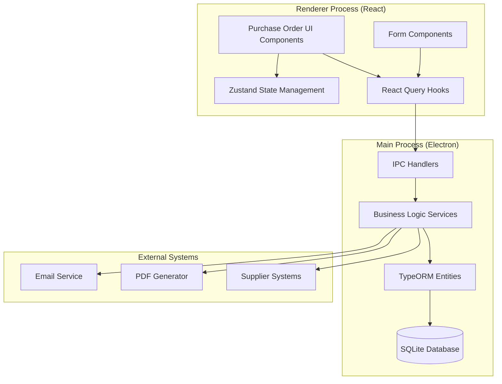
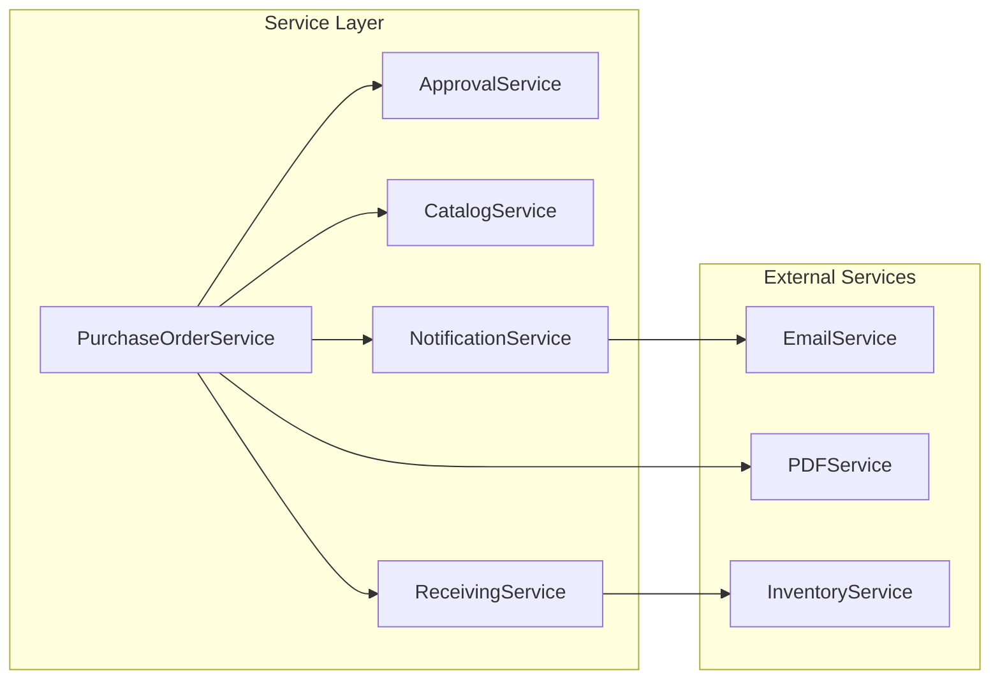

# Purchase Order Management System - Design Document

## Overview

The Purchase Order Management System is a comprehensive module within the POS application that enables users to create, manage, and track purchase orders for inventory replenishment. Built on the existing Electron + React + TypeScript architecture, this system integrates seamlessly with the current masterfile and transaction patterns while providing advanced features for supplier management, approval workflows, and inventory integration.

### Key Features

- **Multi-step Purchase Order Creation**: Guided workflow for creating purchase orders with supplier selection, product catalog integration, and line item management
- **Approval Workflow System**: Configurable approval routing based on purchase order amounts and organizational hierarchy
- **Supplier Catalog Management**: Parser and pretty-printer for supplier catalogs with round-trip validation
- **Real-time Status Tracking**: Comprehensive status management from draft to completion with audit trails
- **Inventory Integration**: Seamless integration with existing inventory management for stock level updates
- **Document Generation**: PDF generation and email transmission to suppliers
- **Comprehensive Reporting**: Analytics and performance tracking for purchase orders and suppliers

### Design Principles

1. **Consistency with Existing Patterns**: Follows established patterns from customer-form.tsx and use-masterfile.ts
2. **Modular Architecture**: Clean separation between UI components, business logic, and data access
3. **Type Safety**: Comprehensive TypeScript typing throughout the system
4. **Performance Optimization**: Efficient data fetching with React Query and proper caching strategies
5. **Security First**: Role-based access control and comprehensive audit trails
6. **Extensibility**: Designed for future enhancements and integrations

## Architecture

### System Architecture Overview



### Component Hierarchy

```
src/renderer/src/POS/features/purchase-order/
├── components/
│   ├── purchase-order-form/
│   │   ├── PurchaseOrderForm.tsx
│   │   ├── PurchaseOrderHeader.tsx
│   │   ├── SupplierSelection.tsx
│   │   ├── LineItemsGrid.tsx
│   │   └── PurchaseOrderSummary.tsx
│   ├── approval-workflow/
│   │   ├── ApprovalWorkflow.tsx
│   │   ├── ApprovalCard.tsx
│   │   └── ApprovalHistory.tsx
│   ├── receiving/
│   │   ├── ReceivingForm.tsx
│   │   ├── ReceivingLineItems.tsx
│   │   └── DiscrepancyReport.tsx
│   ├── catalog-management/
│   │   ├── CatalogParser.tsx
│   │   ├── CatalogViewer.tsx
│   │   └── CatalogImport.tsx
│   └── reports/
│       ├── PurchaseOrderReports.tsx
│       ├── SupplierPerformance.tsx
│       └── SpendingAnalysis.tsx
├── hooks/
│   ├── use-purchase-order.ts
│   ├── use-approval-workflow.ts
│   ├── use-catalog-parser.ts
│   └── use-receiving.ts
├── store/
│   ├── use-purchase-order-store.ts
│   ├── use-approval-store.ts
│   └── use-catalog-store.ts
├── types/
│   ├── purchase-order.types.ts
│   ├── approval.types.ts
│   └── catalog.types.ts
└── utils/
    ├── purchase-order-validators.ts
    ├── catalog-parser.ts
    └── pdf-generator.ts
```

### Service Layer Architecture



## Components and Interfaces

### Core Components

#### PurchaseOrderForm Component

```typescript
interface PurchaseOrderFormProps {
  purchaseOrderId?: number
  mode: 'create' | 'edit' | 'view'
  onSave?: (purchaseOrder: PurchaseOrder) => void
  onCancel?: () => void
}

const PurchaseOrderForm: React.FC<PurchaseOrderFormProps> = ({
  purchaseOrderId,
  mode,
  onSave,
  onCancel
}) => {
  // Implementation follows customer-form.tsx patterns
  // Uses react-hook-form with zod validation
  // Integrates with use-purchase-order hook
}
```

#### SupplierSelection Component

```typescript
interface SupplierSelectionProps {
  selectedSupplierId?: number
  onSupplierChange: (supplier: Supplier) => void
  disabled?: boolean
}

const SupplierSelection: React.FC<SupplierSelectionProps> = ({
  selectedSupplierId,
  onSupplierChange,
  disabled
}) => {
  // Autocomplete component with supplier lookup
  // Displays supplier details and payment terms
  // Integrates with catalog loading
}
```

#### LineItemsGrid Component

```typescript
interface LineItemsGridProps {
  lineItems: PurchaseOrderLineItem[]
  supplierId?: number
  onLineItemsChange: (items: PurchaseOrderLineItem[]) => void
  readonly?: boolean
}

const LineItemsGrid: React.FC<LineItemsGridProps> = ({
  lineItems,
  supplierId,
  onLineItemsChange,
  readonly
}) => {
  // DataGrid component for line item management
  // Product selection with catalog integration
  // Real-time calculations and validation
}
```

### Hook Interfaces

#### usePurchaseOrder Hook

```typescript
interface UsePurchaseOrderOptions {
  purchaseOrderId?: number
  includeLineItems?: boolean
  includeApprovalHistory?: boolean
}

interface UsePurchaseOrderReturn {
  // Query hooks
  purchaseOrder: PurchaseOrder | undefined
  lineItems: PurchaseOrderLineItem[]
  approvalHistory: ApprovalHistoryItem[]
  isLoading: boolean
  error: Error | null
  
  // Mutation hooks
  savePurchaseOrder: UseMutationResult<PurchaseOrder, Error, SavePurchaseOrderPayload>
  deletePurchaseOrder: UseMutationResult<void, Error, number>
  submitForApproval: UseMutationResult<void, Error, number>
  sendToSupplier: UseMutationResult<void, Error, SendToSupplierPayload>
  
  // Utility functions
  calculateTotals: (lineItems: PurchaseOrderLineItem[]) => PurchaseOrderTotals
  validatePurchaseOrder: (purchaseOrder: PurchaseOrder) => ValidationResult
}

const usePurchaseOrder = (options?: UsePurchaseOrderOptions): UsePurchaseOrderReturn
```

#### useApprovalWorkflow Hook

```typescript
interface UseApprovalWorkflowReturn {
  // Query hooks
  pendingApprovals: PurchaseOrder[]
  approvalHistory: ApprovalHistoryItem[]
  approvalRules: ApprovalRule[]
  
  // Mutation hooks
  approvePurchaseOrder: UseMutationResult<void, Error, ApprovalPayload>
  rejectPurchaseOrder: UseMutationResult<void, Error, RejectionPayload>
  requestModification: UseMutationResult<void, Error, ModificationRequestPayload>
  
  // Utility functions
  getRequiredApprovers: (amount: number) => User[]
  canApprove: (purchaseOrderId: number, userId: number) => boolean
}

const useApprovalWorkflow = (): UseApprovalWorkflowReturn
```

### State Management Interfaces

#### Purchase Order Store

```typescript
interface PurchaseOrderState {
  // Current form state
  currentPurchaseOrder: PurchaseOrder | null
  currentLineItems: PurchaseOrderLineItem[]
  selectedSupplierId: number | null
  
  // UI state
  isFormOpen: boolean
  formMode: 'create' | 'edit' | 'view'
  activeStep: number
  
  // Filters and search
  filters: PurchaseOrderFilters
  searchTerm: string
  sortBy: string
  sortOrder: 'asc' | 'desc'
  
  // Actions
  setCurrentPurchaseOrder: (po: PurchaseOrder | null) => void
  setCurrentLineItems: (items: PurchaseOrderLineItem[]) => void
  setSelectedSupplierId: (id: number | null) => void
  setIsFormOpen: (open: boolean) => void
  setFormMode: (mode: 'create' | 'edit' | 'view') => void
  setActiveStep: (step: number) => void
  setFilters: (filters: PurchaseOrderFilters) => void
  setSearchTerm: (term: string) => void
  setSortBy: (field: string) => void
  setSortOrder: (order: 'asc' | 'desc') => void
  resetForm: () => void
}

const usePurchaseOrderStore = create<PurchaseOrderState>((set, get) => ({
  // Implementation following existing store patterns
}))
```

## Data Models

### Enhanced Purchase Order Entity

```typescript
// Extended from existing TrnPurchaseOrderEntity
@Entity(POSEntity.TRN_PURCHASE_ORDER)
export class TrnPurchaseOrderEntity extends BaseEntity {
  // Existing fields...
  
  // Enhanced fields for comprehensive management
  @Column({ name: 'Status', type: 'nvarchar', length: 50, nullable: false, default: 'Draft' })
  status: PurchaseOrderStatus
  
  @Column({ name: 'ExpectedDeliveryDate', type: 'datetimeoffset', nullable: true })
  expectedDeliveryDate: Date | null
  
  @Column({ name: 'ActualDeliveryDate', type: 'datetimeoffset', nullable: true })
  actualDeliveryDate: Date | null
  
  @Column({ name: 'TotalAmount', type: 'decimal', precision: 18, scale: 5, nullable: false })
  totalAmount: number
  
  @Column({ name: 'TaxAmount', type: 'decimal', precision: 18, scale: 5, nullable: false, default: 0 })
  taxAmount: number
  
  @Column({ name: 'ShippingAmount', type: 'decimal', precision: 18, scale: 5, nullable: false, default: 0 })
  shippingAmount: number
  
  @Column({ name: 'DiscountAmount', type: 'decimal', precision: 18, scale: 5, nullable: false, default: 0 })
  discountAmount: number
  
  @Column({ name: 'ApprovalLevel', type: 'int', nullable: false, default: 0 })
  approvalLevel: number
  
  @Column({ name: 'RequiredApprovalLevel', type: 'int', nullable: false, default: 0 })
  requiredApprovalLevel: number
  
  @Column({ name: 'SentToSupplierDate', type: 'datetimeoffset', nullable: true })
  sentToSupplierDate: Date | null
  
  @Column({ name: 'SupplierConfirmationDate', type: 'datetimeoffset', nullable: true })
  supplierConfirmationDate: Date | null
  
  @Column({ name: 'CancellationReason', type: 'nvarchar', nullable: true })
  cancellationReason: string | null
  
  @Column({ name: 'CancelledBy', type: 'int', nullable: true })
  cancelledBy: number | null
  
  @Column({ name: 'CancelledDate', type: 'datetimeoffset', nullable: true })
  cancelledDate: Date | null
  
  @Column({ name: 'Version', type: 'int', nullable: false, default: 1 })
  version: number
  
  @Column({ name: 'ParentPurchaseOrderId', type: 'int', nullable: true })
  parentPurchaseOrderId: number | null
  
  // Relationships
  @OneToMany(() => TrnPurchaseOrderLineEntity, (line) => line.purchaseOrder, { cascade: true })
  lineItems?: TrnPurchaseOrderLineEntity[]
  
  @OneToMany(() => TrnPurchaseOrderApprovalEntity, (approval) => approval.purchaseOrder, { cascade: true })
  approvals?: TrnPurchaseOrderApprovalEntity[]
  
  @OneToMany(() => TrnPurchaseOrderReceivingEntity, (receiving) => receiving.purchaseOrder, { cascade: true })
  receivings?: TrnPurchaseOrderReceivingEntity[]
  
  @ManyToOne(() => TrnPurchaseOrderEntity)
  @JoinColumn({ name: 'ParentPurchaseOrderId' })
  parentPurchaseOrder?: TrnPurchaseOrderEntity
  
  @ManyToOne(() => MstUserEntity)
  @JoinColumn({ name: 'CancelledBy' })
  cancelledByUser?: MstUserEntity
}
```

### Purchase Order Line Entity Enhancement

```typescript
// Extended from existing TrnPurchaseOrderLineEntity
@Entity(POSEntity.TRN_PURCHASE_ORDER_LINE)
export class TrnPurchaseOrderLineEntity extends BaseEntity {
  // Existing fields...
  
  // Enhanced fields
  @Column({ name: 'LineNumber', type: 'int', nullable: false })
  lineNumber: number
  
  @Column({ name: 'Description', type: 'nvarchar', length: 500, nullable: true })
  description: string | null
  
  @Column({ name: 'UnitCost', type: 'decimal', precision: 18, scale: 5, nullable: false })
  unitCost: number
  
  @Column({ name: 'TotalCost', type: 'decimal', precision: 18, scale: 5, nullable: false })
  totalCost: number
  
  @Column({ name: 'TaxRate', type: 'decimal', precision: 5, scale: 2, nullable: false, default: 0 })
  taxRate: number
  
  @Column({ name: 'TaxAmount', type: 'decimal', precision: 18, scale: 5, nullable: false, default: 0 })
  taxAmount: number
  
  @Column({ name: 'DiscountRate', type: 'decimal', precision: 5, scale: 2, nullable: false, default: 0 })
  discountRate: number
  
  @Column({ name: 'DiscountAmount', type: 'decimal', precision: 18, scale: 5, nullable: false, default: 0 })
  discountAmount: number
  
  @Column({ name: 'ReceivedQuantity', type: 'decimal', precision: 18, scale: 5, nullable: false, default: 0 })
  receivedQuantity: number
  
  @Column({ name: 'RemainingQuantity', type: 'decimal', precision: 18, scale: 5, nullable: false })
  remainingQuantity: number
  
  @Column({ name: 'Status', type: 'nvarchar', length: 50, nullable: false, default: 'Pending' })
  status: LineItemStatus
  
  @Column({ name: 'ExpectedDeliveryDate', type: 'datetimeoffset', nullable: true })
  expectedDeliveryDate: Date | null
  
  @Column({ name: 'SupplierItemCode', type: 'nvarchar', length: 100, nullable: true })
  supplierItemCode: string | null
  
  @Column({ name: 'Notes', type: 'nvarchar', length: 1000, nullable: true })
  notes: string | null
}
```

### New Supporting Entities

#### Purchase Order Approval Entity

```typescript
@Entity(POSEntity.TRN_PURCHASE_ORDER_APPROVAL)
export class TrnPurchaseOrderApprovalEntity extends BaseEntity {
  @Column({ name: 'PurchaseOrderId', type: 'int', nullable: false })
  purchaseOrderId: number
  
  @Column({ name: 'ApprovalLevel', type: 'int', nullable: false })
  approvalLevel: number
  
  @Column({ name: 'ApproverId', type: 'int', nullable: false })
  approverId: number
  
  @Column({ name: 'ApprovalDate', type: 'datetimeoffset', nullable: true })
  approvalDate: Date | null
  
  @Column({ name: 'Status', type: 'nvarchar', length: 50, nullable: false })
  status: ApprovalStatus
  
  @Column({ name: 'Comments', type: 'nvarchar', length: 1000, nullable: true })
  comments: string | null
  
  @Column({ name: 'RejectionReason', type: 'nvarchar', length: 500, nullable: true })
  rejectionReason: string | null
  
  // Relationships
  @ManyToOne(() => TrnPurchaseOrderEntity)
  @JoinColumn({ name: 'PurchaseOrderId' })
  purchaseOrder?: TrnPurchaseOrderEntity
  
  @ManyToOne(() => MstUserEntity)
  @JoinColumn({ name: 'ApproverId' })
  approver?: MstUserEntity
}
```

#### Purchase Order Receiving Entity

```typescript
@Entity(POSEntity.TRN_PURCHASE_ORDER_RECEIVING)
export class TrnPurchaseOrderReceivingEntity extends BaseEntity {
  @Column({ name: 'PurchaseOrderId', type: 'int', nullable: false })
  purchaseOrderId: number
  
  @Column({ name: 'ReceivingNumber', type: 'nvarchar', length: 50, nullable: false })
  receivingNumber: string
  
  @Column({ name: 'ReceivingDate', type: 'datetimeoffset', nullable: false })
  receivingDate: Date
  
  @Column({ name: 'ReceivedBy', type: 'int', nullable: false })
  receivedBy: number
  
  @Column({ name: 'DeliveryNote', type: 'nvarchar', length: 100, nullable: true })
  deliveryNote: string | null
  
  @Column({ name: 'Notes', type: 'nvarchar', length: 1000, nullable: true })
  notes: string | null
  
  @Column({ name: 'Status', type: 'nvarchar', length: 50, nullable: false })
  status: ReceivingStatus
  
  // Relationships
  @ManyToOne(() => TrnPurchaseOrderEntity)
  @JoinColumn({ name: 'PurchaseOrderId' })
  purchaseOrder?: TrnPurchaseOrderEntity
  
  @ManyToOne(() => MstUserEntity)
  @JoinColumn({ name: 'ReceivedBy' })
  receivedByUser?: MstUserEntity
  
  @OneToMany(() => TrnPurchaseOrderReceivingLineEntity, (line) => line.receiving, { cascade: true })
  lineItems?: TrnPurchaseOrderReceivingLineEntity[]
}
```

#### Supplier Catalog Entity

```typescript
@Entity(POSEntity.MST_SUPPLIER_CATALOG)
export class MstSupplierCatalogEntity extends BaseEntity {
  @Column({ name: 'SupplierId', type: 'int', nullable: false })
  supplierId: number
  
  @Column({ name: 'ItemId', type: 'int', nullable: false })
  itemId: number
  
  @Column({ name: 'SupplierItemCode', type: 'nvarchar', length: 100, nullable: false })
  supplierItemCode: string
  
  @Column({ name: 'SupplierItemName', type: 'nvarchar', length: 255, nullable: false })
  supplierItemName: string
  
  @Column({ name: 'SupplierItemDescription', type: 'nvarchar', length: 500, nullable: true })
  supplierItemDescription: string | null
  
  @Column({ name: 'UnitCost', type: 'decimal', precision: 18, scale: 5, nullable: false })
  unitCost: number
  
  @Column({ name: 'MinimumOrderQuantity', type: 'decimal', precision: 18, scale: 5, nullable: false, default: 1 })
  minimumOrderQuantity: number
  
  @Column({ name: 'LeadTimeDays', type: 'int', nullable: false, default: 0 })
  leadTimeDays: number
  
  @Column({ name: 'IsActive', type: 'bit', nullable: false, default: true })
  isActive: boolean
  
  @Column({ name: 'LastUpdated', type: 'datetimeoffset', nullable: false })
  lastUpdated: Date
  
  // Relationships
  @ManyToOne(() => MstSupplierEntity)
  @JoinColumn({ name: 'SupplierId' })
  supplier?: MstSupplierEntity
  
  @ManyToOne(() => MstItemEntity)
  @JoinColumn({ name: 'ItemId' })
  item?: MstItemEntity
}
```

### TypeScript Type Definitions

```typescript
// Purchase Order Types
export enum PurchaseOrderStatus {
  DRAFT = 'Draft',
  PENDING_APPROVAL = 'Pending_Approval',
  APPROVED = 'Approved',
  SENT = 'Sent',
  CONFIRMED = 'Confirmed',
  PARTIALLY_RECEIVED = 'Partially_Received',
  COMPLETED = 'Completed',
  CANCELLED = 'Cancelled',
  REJECTED = 'Rejected'
}

export enum LineItemStatus {
  PENDING = 'Pending',
  CONFIRMED = 'Confirmed',
  PARTIALLY_RECEIVED = 'Partially_Received',
  RECEIVED = 'Received',
  CANCELLED = 'Cancelled'
}

export enum ApprovalStatus {
  PENDING = 'Pending',
  APPROVED = 'Approved',
  REJECTED = 'Rejected',
  MODIFICATION_REQUESTED = 'Modification_Requested'
}

export enum ReceivingStatus {
  PENDING = 'Pending',
  PARTIAL = 'Partial',
  COMPLETE = 'Complete',
  DISCREPANCY = 'Discrepancy'
}

// Form Data Types
export interface PurchaseOrderFormData {
  supplierId: number
  expectedDeliveryDate: Date | null
  remarks: string | null
  lineItems: PurchaseOrderLineItemFormData[]
}

export interface PurchaseOrderLineItemFormData {
  itemId: number
  quantity: number
  unitCost: number
  description?: string
  notes?: string
}

// API Payload Types
export interface SavePurchaseOrderPayload {
  purchaseOrder: PurchaseOrderFormData
  lineItems: PurchaseOrderLineItemFormData[]
}

export interface SendToSupplierPayload {
  purchaseOrderId: number
  emailAddress: string
  subject: string
  message: string
  attachPDF: boolean
}

export interface ApprovalPayload {
  purchaseOrderId: number
  comments?: string
}

export interface RejectionPayload {
  purchaseOrderId: number
  rejectionReason: string
  comments?: string
}

// Catalog Types
export interface SupplierCatalogItem {
  supplierItemCode: string
  supplierItemName: string
  supplierItemDescription?: string
  unitCost: number
  minimumOrderQuantity: number
  leadTimeDays: number
  itemId?: number
}

export interface CatalogParseResult {
  success: boolean
  items: SupplierCatalogItem[]
  errors: string[]
  warnings: string[]
}

// Filter and Search Types
export interface PurchaseOrderFilters {
  status?: PurchaseOrderStatus[]
  supplierId?: number
  dateFrom?: Date
  dateTo?: Date
  amountFrom?: number
  amountTo?: number
  createdBy?: number
  approvedBy?: number
}

// Report Types
export interface PurchaseOrderSummaryReport {
  totalOrders: number
  totalAmount: number
  averageOrderValue: number
  ordersByStatus: Record<PurchaseOrderStatus, number>
  topSuppliers: SupplierSummary[]
  monthlyTrends: MonthlyTrend[]
}

export interface SupplierPerformanceReport {
  supplierId: number
  supplierName: string
  totalOrders: number
  totalAmount: number
  averageDeliveryTime: number
  onTimeDeliveryRate: number
  qualityScore: number
  lastOrderDate: Date
}
```

Now I need to conduct prework analysis for the acceptance criteria before writing the Correctness Properties section.

<function_calls>
<invoke name="prework">
<parameter name="featureName">purchase-order