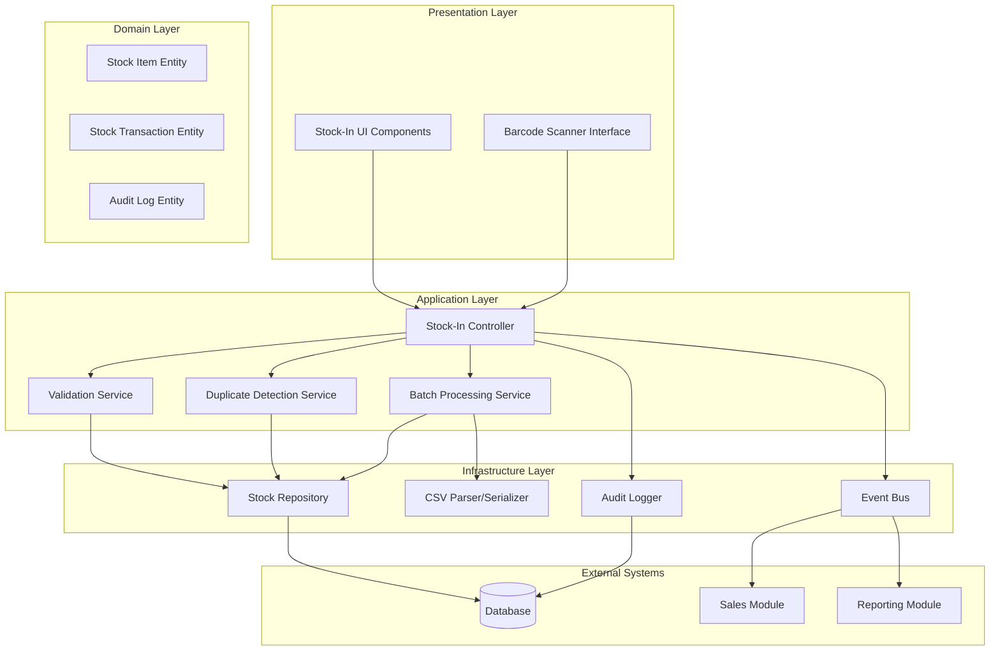

# Design Document: Stock-In Feature

## Overview

The Stock-In feature is a comprehensive inventory management module that enables POS system users to add new inventory items and increase stock quantities for existing items. The system provides a robust, secure, and scalable solution for managing incoming inventory transactions with full audit trails, data validation, and seamless integration with existing POS modules.

### Key Design Principles

- **Atomic Transactions**: All operations are atomic to prevent partial updates and maintain data consistency
- **Real-time Validation**: Comprehensive validation at multiple layers with immediate user feedback
- **Audit-First**: Complete audit trail for all operations to ensure compliance and traceability
- **Performance-Oriented**: Sub-second response times for individual operations with efficient batch processing
- **Security-Focused**: Role-based access control with encryption and session management
- **Integration-Ready**: Seamless integration with existing POS modules through event-driven architecture

## Architecture

### System Architecture Overview



### Module Structure

Following the modular architecture pattern:

```
/modules/stock-in/
├── components/           # UI Components
├── services/            # Business Logic Services
├── entities/            # Domain Entities
├── repositories/        # Data Access Layer
├── validators/          # Validation Logic
├── parsers/            # CSV Parser/Serializer
├── types/              # TypeScript Type Definitions
└── tests/              # Test Files
```

## Components and Interfaces

### Core Components

#### 1. Stock-In Controller
**Responsibility**: Orchestrates stock-in operations and coordinates between services

```typescript
interface IStockInController {
  createStockItem(itemData: CreateStockItemRequest): Promise<StockItemResponse>;
  updateStockQuantity(itemId: string, quantity: number): Promise<StockTransactionResponse>;
  processBatch(file: File): Promise<BatchProcessingResponse>;
  scanBarcode(barcode: string): Promise<BarcodeSearchResponse>;
}
```

#### 2. Validation Service
**Responsibility**: Validates all input data according to business rules

```typescript
interface IValidationService {
  validateStockItem(item: StockItemData): ValidationResult;
  validateQuantity(quantity: number): ValidationResult;
  validatePrice(price: number): ValidationResult;
  validateBarcode(barcode: string): ValidationResult;
}
```

#### 3. Duplicate Detection Service
**Responsibility**: Identifies potential duplicate items using fuzzy matching

```typescript
interface IDuplicateDetectionService {
  findPotentialDuplicates(item: StockItemData): Promise<DuplicateMatch[]>;
  calculateSimilarity(item1: StockItemData, item2: StockItemData): number;
  suggestMerge(duplicates: DuplicateMatch[]): MergeRecommendation;
}
```

#### 4. Batch Processing Service
**Responsibility**: Handles bulk operations and CSV processing

```typescript
interface IBatchProcessingService {
  processCsvFile(file: File): Promise<BatchProcessingResult>;
  validateBatch(items: StockItemData[]): BatchValidationResult;
  processBatchItems(items: StockItemData[]): Promise<BatchProcessingResult>;
}
```

#### 5. Audit Logger
**Responsibility**: Records all transactions and system events

```typescript
interface IAuditLogger {
  logStockTransaction(transaction: StockTransaction): Promise<void>;
  logSystemEvent(event: SystemEvent): Promise<void>;
  generateAuditReport(criteria: AuditCriteria): Promise<AuditReport>;
}
```

### UI Components

#### 1. Stock Item Form Component
```typescript
interface StockItemFormProps {
  mode: 'create' | 'update';
  initialData?: Partial<StockItemData>;
  onSubmit: (data: StockItemData) => Promise<void>;
  onCancel: () => void;
}
```

#### 2. Barcode Scanner Component
```typescript
interface BarcodeScannerProps {
  onScan: (barcode: string) => void;
  onError: (error: ScanError) => void;
  supportedFormats: BarcodeFormat[];
}
```

#### 3. Batch Upload Component
```typescript
interface BatchUploadProps {
  onFileSelect: (file: File) => void;
  onProcessingComplete: (result: BatchProcessingResult) => void;
  maxFileSize: number;
  supportedFormats: string[];
}
```

## Data Models

### Core Entities

#### Stock Item Entity
```typescript
interface StockItem {
  id: string;
  itemCode: string;
  name: string;
  description?: string;
  category: string;
  unit: string;
  barcode?: string;
  price: number;
  currentStock: number;
  minimumStock: number;
  maximumStock: number;
  createdAt: Date;
  updatedAt: Date;
  createdBy: string;
  updatedBy: string;
}
```

#### Stock Transaction Entity
```typescript
interface StockTransaction {
  id: string;
  transactionNumber: string;
  itemId: string;
  transactionType: 'STOCK_IN' | 'STOCK_OUT' | 'ADJUSTMENT';
  quantity: number;
  previousStock: number;
  newStock: number;
  unitPrice?: number;
  totalValue?: number;
  reference?: string;
  notes?: string;
  timestamp: Date;
  userId: string;
  status: 'PENDING' | 'COMPLETED' | 'FAILED' | 'ROLLED_BACK';
}
```

#### Audit Log Entity
```typescript
interface AuditLog {
  id: string;
  entityType: string;
  entityId: string;
  action: string;
  oldValues?: Record<string, any>;
  newValues?: Record<string, any>;
  userId: string;
  timestamp: Date;
  ipAddress?: string;
  userAgent?: string;
  sessionId: string;
}
```

### Request/Response Models

#### Create Stock Item Request
```typescript
interface CreateStockItemRequest {
  itemCode: string;
  name: string;
  description?: string;
  category: string;
  unit: string;
  barcode?: string;
  price: number;
  initialStock: number;
  minimumStock: number;
  maximumStock: number;
}
```

#### Stock Item Response
```typescript
interface StockItemResponse {
  success: boolean;
  data?: StockItem;
  error?: ErrorDetails;
  validationErrors?: ValidationError[];
}
```

#### Batch Processing Result
```typescript
interface BatchProcessingResult {
  totalItems: number;
  successfulItems: number;
  failedItems: number;
  errors: BatchError[];
  processingTime: number;
  transactionIds: string[];
}
```

### Validation Models

#### Validation Result
```typescript
interface ValidationResult {
  isValid: boolean;
  errors: ValidationError[];
  warnings: ValidationWarning[];
}

interface ValidationError {
  field: string;
  message: string;
  code: string;
  severity: 'ERROR' | 'WARNING';
}
```

## API Specifications

### REST API Endpoints

#### Stock Items Management
```typescript
// Create new stock item
POST /api/stock-in/items
Content-Type: application/json
Body: CreateStockItemRequest
Response: StockItemResponse

// Update stock quantity
PUT /api/stock-in/items/{itemId}/quantity
Content-Type: application/json
Body: { quantity: number, reference?: string }
Response: StockTransactionResponse

// Search items by barcode
GET /api/stock-in/items/barcode/{barcode}
Response: BarcodeSearchResponse

// Get item details
GET /api/stock-in/items/{itemId}
Response: StockItemResponse
```

#### Batch Operations
```typescript
// Upload and process CSV file
POST /api/stock-in/batch/upload
Content-Type: multipart/form-data
Body: FormData with file
Response: BatchProcessingResponse

// Get batch processing status
GET /api/stock-in/batch/{batchId}/status
Response: BatchStatusResponse
```

#### Validation and Duplicates
```typescript
// Validate item data
POST /api/stock-in/validate
Content-Type: application/json
Body: StockItemData
Response: ValidationResult

// Check for duplicates
POST /api/stock-in/duplicates/check
Content-Type: application/json
Body: StockItemData
Response: DuplicateCheckResponse
```

#### Audit and Reporting
```typescript
// Get audit trail
GET /api/stock-in/audit?startDate={date}&endDate={date}&userId={id}
Response: AuditTrailResponse

// Export audit report
GET /api/stock-in/audit/export?format={csv|pdf}&criteria={criteria}
Response: File download
```

### Event-Driven Integration

#### Published Events
```typescript
// Stock level changed event
interface StockLevelChangedEvent {
  eventType: 'STOCK_LEVEL_CHANGED';
  itemId: string;
  previousStock: number;
  newStock: number;
  transactionId: string;
  timestamp: Date;
}

// New item created event
interface ItemCreatedEvent {
  eventType: 'ITEM_CREATED';
  itemId: string;
  itemData: StockItem;
  timestamp: Date;
}
```

#### Consumed Events
```typescript
// User session events for security
interface UserSessionEvent {
  eventType: 'SESSION_TIMEOUT' | 'SESSION_INVALIDATED';
  userId: string;
  sessionId: string;
  timestamp: Date;
}
```

## Correctness Properties

*A property is a characteristic or behavior that should hold true across all valid executions of a system-essentially, a formal statement about what the system should do. Properties serve as the bridge between human-readable specifications and machine-verifiable correctness guarantees.*

### Property 1: Required Field Validation

*For any* stock item creation request, if any required field (name, category, unit) is missing, the validation SHALL reject the request with specific error messages.

**Validates: Requirements 1.1, 4.1**

### Property 2: Item Code Uniqueness

*For any* item code, the system SHALL ensure that no two stock items can have the same item code within the system.

**Validates: Requirements 1.2**

### Property 3: Unique Identifier Generation

*For any* sequence of stock item creations, all generated item identifiers SHALL be unique across the entire system.

**Validates: Requirements 1.4**

### Property 4: Audit Trail Completeness

*For any* stock item creation or modification, the audit logger SHALL record a complete audit entry containing timestamp, user, and all relevant transaction details.

**Validates: Requirements 1.5, 6.5**

### Property 5: Quantity Validation

*For any* quantity input, the system SHALL accept only positive numeric values and reject negative, zero, or non-numeric inputs.

**Validates: Requirements 2.1**

### Property 6: Decimal Precision Maintenance

*For any* decimal quantity input, the system SHALL maintain precision to exactly 3 decimal places without loss of accuracy.

**Validates: Requirements 2.5**

### Property 7: Barcode Format Support

*For any* barcode input, the system SHALL correctly identify and process EAN-13, UPC-A, and Code-128 formats while rejecting unsupported formats.

**Validates: Requirements 3.3, 3.5**

### Property 8: Price Validation Range

*For any* price input, the system SHALL accept only non-negative values within reasonable business ranges and reject invalid prices.

**Validates: Requirements 4.3**

### Property 9: Character Validation for Names

*For any* item name input, the system SHALL accept only alphanumeric characters and spaces while rejecting names containing special characters or symbols.

**Validates: Requirements 4.5**

### Property 10: Fuzzy Matching Threshold

*For any* pair of item names or descriptions, the duplicate detector SHALL correctly identify similarity above 85% threshold and ignore similarity below this threshold.

**Validates: Requirements 5.3**

### Property 11: Transaction Atomicity

*For any* stock transaction, either all changes SHALL be committed successfully or all changes SHALL be rolled back completely, with no partial updates possible.

**Validates: Requirements 6.1, 6.2**

### Property 12: Sequential Transaction Numbering

*For any* sequence of transactions, the system SHALL generate sequential transaction numbers without gaps or duplicates, even under concurrent access.

**Validates: Requirements 6.3**

### Property 13: Batch Validation Independence

*For any* batch of items, validation failure of individual items SHALL not prevent processing of other valid items in the same batch.

**Validates: Requirements 7.4**

### Property 14: CSV Round-Trip Equivalence

*For any* valid Stock_Item object, serializing to CSV then parsing back to object SHALL produce an equivalent Stock_Item object with all data preserved.

**Validates: Requirements 13.4**

### Property 15: Error Message Specificity

*For any* validation failure, the system SHALL provide specific, descriptive error messages that clearly identify the field and nature of the validation failure.

**Validates: Requirements 4.2, 13.2**

## Error Handling

### Error Classification and Response Strategy

#### Validation Errors
- **Client-Side Validation**: Real-time feedback with field highlighting and inline error messages
- **Server-Side Validation**: Comprehensive validation with detailed error responses
- **Error Recovery**: Auto-save draft data and allow correction without data loss

#### System Errors
- **Database Errors**: Graceful degradation with retry mechanisms and user notification
- **Network Errors**: Queue operations for retry and provide offline capability indicators
- **Integration Errors**: Fallback mechanisms and error logging for external system failures

#### Security Errors
- **Authentication Failures**: Secure error messages without information disclosure
- **Authorization Errors**: Clear access denied messages with appropriate logging
- **Session Timeouts**: Automatic session extension prompts and secure cleanup

### Error Response Format

```typescript
interface ErrorResponse {
  success: false;
  error: {
    code: string;
    message: string;
    details?: Record<string, any>;
    timestamp: Date;
    requestId: string;
  };
  validationErrors?: ValidationError[];
}
```

### Retry and Recovery Mechanisms

#### Automatic Retry Strategy
- **Network Operations**: Exponential backoff with maximum 3 attempts
- **Database Operations**: Immediate retry once, then queue for later processing
- **File Operations**: Retry with different temporary locations

#### Manual Recovery Options
- **Transaction Recovery**: Manual retry buttons for failed operations
- **Data Recovery**: Draft restoration from auto-saved data
- **Batch Recovery**: Partial batch reprocessing for failed items

## Testing Strategy

### Comprehensive Testing Approach

The Stock-In feature requires a dual testing approach combining property-based testing for universal correctness guarantees with example-based testing for specific scenarios and edge cases.

#### Property-Based Testing (Primary)

**Framework**: fast-check (JavaScript/TypeScript property-based testing library)

**Configuration**:
- Minimum 100 iterations per property test
- Custom generators for domain-specific data types
- Shrinking enabled for minimal counterexample identification

**Property Test Implementation**:
Each correctness property will be implemented as a property-based test with the following tag format:
```typescript
// Feature: trn-stock-in, Property 1: Required Field Validation
```

**Key Property Tests**:
1. **Validation Properties**: Test input validation across all possible input combinations
2. **Round-Trip Properties**: Verify CSV serialization/deserialization equivalence
3. **Invariant Properties**: Ensure system invariants are maintained across operations
4. **Performance Properties**: Verify response time requirements under various loads

#### Unit Testing (Complementary)

**Framework**: Jest with TypeScript support

**Coverage Requirements**: Minimum 80% code coverage

**Focus Areas**:
- **Specific Examples**: Concrete test cases for business logic verification
- **Edge Cases**: Boundary conditions and error scenarios
- **Integration Points**: Component interaction verification
- **Mock-Based Testing**: External dependency isolation

#### Integration Testing

**Database Integration**:
- Transaction rollback verification
- Concurrent access testing
- Data consistency validation

**External System Integration**:
- Event publishing verification
- API endpoint testing
- File processing validation

#### End-to-End Testing

**Framework**: Playwright for UI automation

**Critical User Flows**:
1. Complete stock item creation workflow
2. Barcode scanning and item lookup
3. Batch upload and processing
4. Error handling and recovery scenarios

### Test Data Management

#### Property Test Generators

```typescript
// Custom generators for domain entities
const stockItemGenerator = fc.record({
  itemCode: fc.string({ minLength: 1, maxLength: 20 }),
  name: fc.string({ minLength: 1, maxLength: 100 }),
  category: fc.constantFrom('Electronics', 'Clothing', 'Food', 'Books'),
  unit: fc.constantFrom('piece', 'kg', 'liter', 'meter'),
  price: fc.float({ min: 0.01, max: 10000 }),
  initialStock: fc.float({ min: 0, max: 1000 })
});

const barcodeGenerator = fc.oneof(
  fc.string({ minLength: 13, maxLength: 13 }), // EAN-13
  fc.string({ minLength: 12, maxLength: 12 }), // UPC-A
  fc.string({ minLength: 1, maxLength: 128 })  // Code-128
);
```

#### Test Environment Setup

**Database**: In-memory SQLite for unit tests, PostgreSQL for integration tests
**File System**: Temporary directories for file processing tests
**External Services**: Mock implementations for integration testing

### Performance Testing

#### Load Testing Scenarios
- **Individual Operations**: Single item creation under various loads
- **Batch Operations**: Large file processing with concurrent users
- **Database Stress**: High-volume transaction processing

#### Performance Benchmarks
- Item creation: < 1 second (Requirements 2.4)
- Barcode lookup: < 500ms (Requirements 3.1)
- Batch processing: 1000 items in < 30 seconds (Requirements 7.3)
- CSV parsing: 10,000 rows in < 15 seconds (Requirements 13.5)

### Security Testing

#### Authentication and Authorization
- Role-based access control verification
- Session management testing
- Unauthorized access prevention

#### Data Security
- Input sanitization validation
- SQL injection prevention
- Cross-site scripting (XSS) protection
- Data encryption verification

#### Audit and Compliance
- Complete audit trail verification
- Data retention policy compliance
- Export functionality security